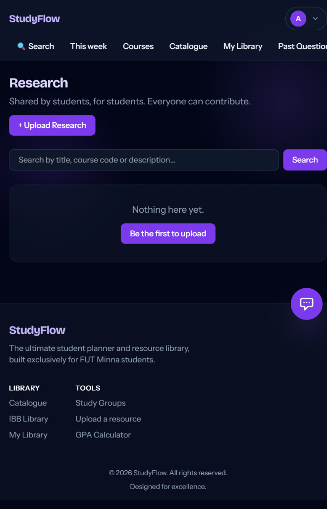
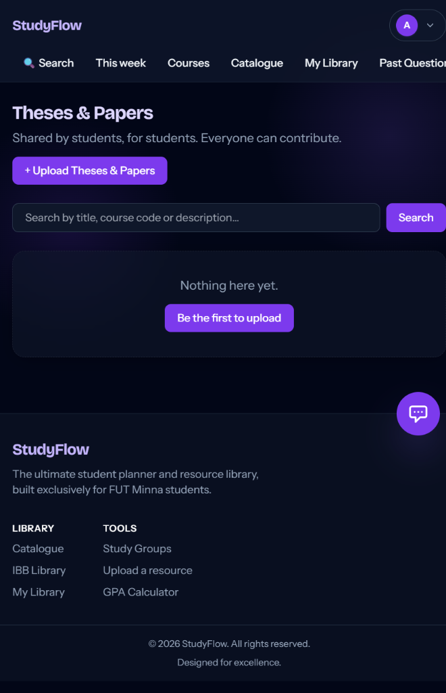

# 📚 StudyFlow

**A full-stack student productivity web app built for university students — built with Django, deployed on Render.**

StudyFlow is an all-in-one study companion that combines smart planning, AI assistance, resource sharing, and focus tools in a single clean, responsive interface. Built for the students of FUT Minna (and any student who wants to study smarter).

---

## ✨ Features at a Glance

| Feature | Description |
|---|---|
| 🤖 AI Study Coach | Groq-powered assistant with conversation memory, LaTeX math rendering, and active recall assistance |
| 📋 Dashboard | Bento-style overview of tasks, courses, recent resources, and quick tools |
| 📚 Catalogue | Global library of books students can browse, save, and read online |
| 🏛️ IBB Library | Reserve physical books at FUT Minna's IBB Library — track loans in real time |
| 📁 Resources | Upload and download Past Questions, Notes, Theses, and Lecture Slides |
| ⏱️ Pomodoro Timer | Study Room with a focus timer, Deep Focus + Lo-Fi Spotify playlists, and session logging |
| 🃏 Flashcards | Create custom decks, flip cards with 3D animation, and quiz yourself with active recall |
| 💬 Campus Chat & Groups | Live campus chat rooms and course-based study groups with 24/7 AI Coach answers |
| 📊 GPA Calculator | 5.0 scale calculator with localStorage persistence |
| 🗓️ Timetable | Build and manage your weekly class timetable |
| 🎮 Break Room | 2048 mini-game with persistent high score for 5-minute Pomodoro breaks |
| 🔐 Google OAuth | 1-tap sign in with Google via django-allauth |
| 🌙 Dark Mode | Instant light/dark theme toggle, persisted in localStorage |
| ✨ Framer Motion | Fluid spring physics animations and micro-interactions throughout |
| 📱 Mobile & Desktop | Fully responsive layout optimized for smartphones, tablets, and laptops |

---

## 🤖 24/7 AI Study Coach

The AI assistant is powered by **Groq API** (ultra-fast LLM inference) running `openai/gpt-oss-20b`.

It is designed to:
- Answer academic questions across engineering, math, coding, and sciences
- Step into study group discussions when classmates aren't online
- Render **LaTeX math equations** using **KaTeX** ($...$ for inline, $$...$$ for display)
- Generate revision flashcards with structured question-answer pairs
- Guide students through derivations step-by-step
- Run seamlessly without requiring upfront login

---

## 🔒 File Upload Security

Resource uploads are strictly validated at **two layers**:

**Frontend (immediate feedback):**
- File extension and MIME type checked in JavaScript before submission
- Max file size enforced (default 10 MB) with clear validation errors
- Drag-and-drop zone with instant visual feedback

**Backend (authoritative):**
- Extension and MIME type validated against configurable allowlist
- **Magic bytes** inspected (e.g. `%PDF-` for PDFs) — renamed `.exe` files are blocked immediately
- A **random UUID filename** is generated server-side — client filenames are never used for storage
- Returns HTTP 400 with a clear error message on invalid files

Allowed types are configured in `.env`:
```env
ALLOWED_TYPES=PDF
# or: ALLOWED_TYPES=PDF, PNG, JPG, JPEG
MAX_UPLOAD_SIZE_MB=10
```

---

## 🛠️ Tech Stack

| Layer | Technology |
|---|---|
| Backend | Python 3.12, Django 6.1.1 |
| AI / LLM | Groq API (`openai/gpt-oss-20b`) |
| Frontend | Tailwind CSS, Framer Motion (Motion engine), Vanilla JS |
| Auth | django-allauth (Google OAuth + Email) |
| Database | SQLite (dev) / PostgreSQL (production) |
| Deployment | Render (Web Service + Managed PostgreSQL) |
| Static Files | WhiteNoise |
| PDF Generation | ReportLab |
| Math Rendering | KaTeX |
| Markdown | marked.js + DOMPurify |
| PWA | Web App Manifest + Service Worker |

---

## 📸 Screenshots

| Landing & Mobile Experience | Courses Hub |
|:---:|:---:|
|  |  |

| Academic Research Hub | Lecture Slides Hub |
|:---:|:---:|
|  |  |

| Theses & Papers Repository |
|:---:|
|  |

---

## 🚀 Getting Started

### Prerequisites

- Python 3.12+
- A [Groq API key](https://console.groq.com/) (free tier available)
- (Optional) Google OAuth credentials for Google sign-in

### 1. Clone the repository

```bash
git clone https://github.com/peterafolabi-dev/studyflow.git
cd studyflow
```

### 2. Create a virtual environment and install dependencies

```bash
python -m venv venv
venv\Scripts\activate   # Windows
# or: source venv/bin/activate  # Mac/Linux

pip install -r requirements.txt
```

### 3. Set up environment variables

Copy `.env.example` to `.env` and fill in your values:

```bash
cp .env.example .env
```

```env
# AI
GROQ_API_KEY=your_groq_api_key_here
MODEL_NAME=openai/gpt-oss-20b

# Upload restrictions
ALLOWED_TYPES=PDF
MAX_UPLOAD_SIZE_MB=10

# Google OAuth (optional)
GOOGLE_OAUTH_CLIENT_ID=your-oauth-client-id
GOOGLE_OAUTH_CLIENT_SECRET=your-oauth-secret
```

### 4. Run migrations and start the development server

```bash
python manage.py migrate
python manage.py runserver
```

Open [http://127.0.0.1:8000](http://127.0.0.1:8000) in your browser.

---

## ☁️ Deploying to Render

1. Push your code to GitHub.
2. Create a new **Web Service** on [Render](https://render.com) and connect your repository.
3. Set the **Build Command** to: `./build.sh`
4. Set the **Start Command** to: `gunicorn studyflow.wsgi:application`
5. Add your environment variables in the Render Dashboard:
   - `GROQ_API_KEY`
   - `SECRET_KEY`
   - `DATABASE_URL` (Render provides this automatically for PostgreSQL)
   - `ALLOWED_TYPES`, `MAX_UPLOAD_SIZE_MB`
   - Google OAuth keys (if using)

---

## 📁 Project Structure

```
studyflow/
├── accounts/          # User auth, profiles, notifications
├── community/         # Study groups, thread discussions, find buddies, campus chat
├── library/           # Digital catalogue and book reading
├── planner/           # Dashboard, tasks, courses, flashcards, GPA, study room, break room
├── resources/         # File uploads (past questions, notes, etc.), IBB Library
├── studyflow/         # Django project settings and upload config
├── templates/         # All Django HTML templates
├── static/            # CSS, custom scrollbars, and PWA icons
├── screenshots/       # App screenshots for the README
├── requirements.txt
├── build.sh
└── manage.py
```

---

## 🛡️ Security Highlights

- **CSRF:** Django CSRF tokens enforced on all state-changing requests
- **XSS Prevention:** AI chat output sanitized with DOMPurify before DOM insertion
- **Upload Security:** Magic-byte file content validation + UUID safe filenames
- **OAuth 2.0:** Handled securely via django-allauth with PyJWT
- **HTTPS:** Enforced in production via Render + Django secure settings (`SECURE_SSL_REDIRECT`, `SESSION_COOKIE_SECURE`, `CSRF_COOKIE_SECURE`)

---

## 📄 License

MIT License — free to use, modify, and distribute.

---

## 🙏 Built by

A FUT Minna **Engineering** student building tools that actually help students win. ⚔️

> *"Every student who opens this app is an athlete in training, and their studies are the arena."*