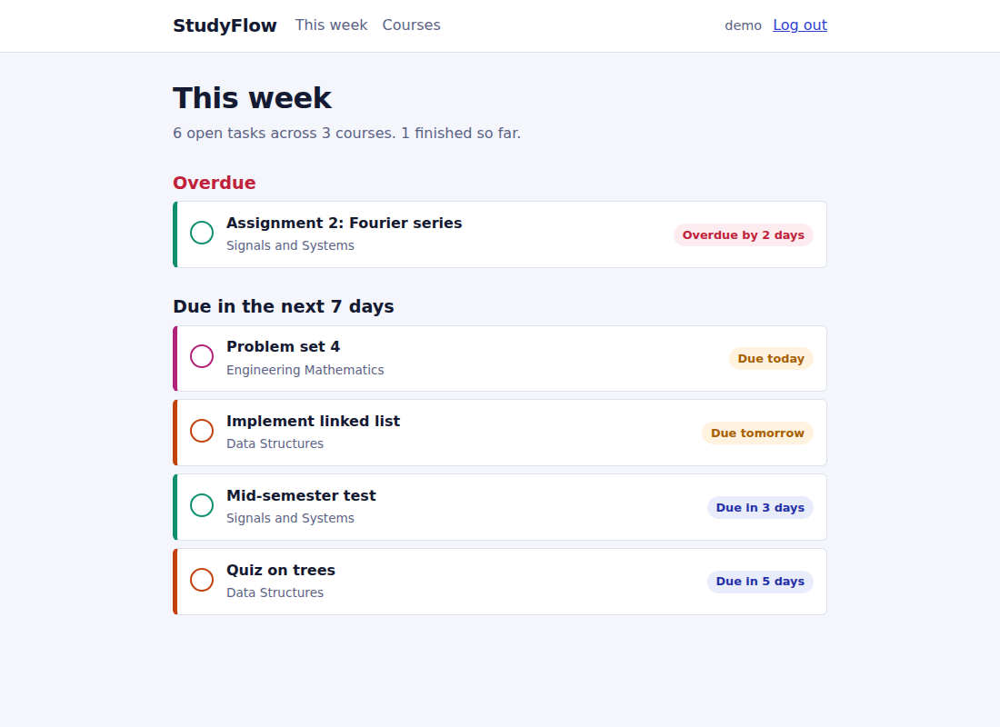
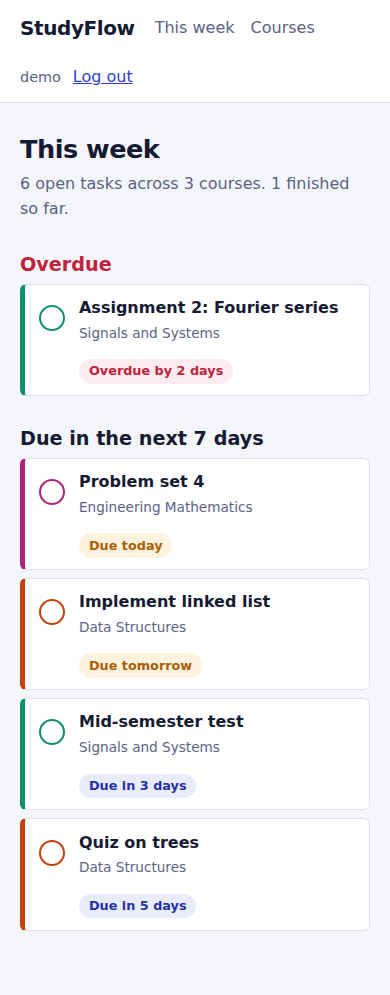

# StudyFlow

An all-in-one study platform for university students: a deadline planner, a reading hub, a shared library of past questions and notes, physical-library borrowing, and study groups, in one purple, dark-mode-ready web app.

Built solo with Django. Created with FUT Minna students in mind (the physical library section is modelled on the IBB Library).

<!-- Add this line once it is deployed:
**Live demo:** https://your-app-url-here
-->

## Screenshots

| Dashboard | Catalogue |
|---|---|
|  |  |

| Book page | IBB Library |
|---|---|
|  |  |

| Dark mode | Mobile |
|---|---|
|  |  |

## Features

**Planner**
- Courses and tasks with due dates; a "This week" dashboard showing what's overdue or due in the next 7 days
- Weekly class timetable
- GPA calculator (5-point scale)
- Export task deadlines to a `.ics` file for Google, Apple or Outlook Calendar

**Reading hub**
- Catalogue of books across levels 100 to 500, plus a separate Postgraduate shelf
- Search, subject and level filters
- Book pages with ratings and similar-reading suggestions
- Read online (in-browser reader) and download as PDF
- My Library with reading progress: To read, Reading, Finished
- Reader rank badge (Newcomer, Scholar, Bookworm, Legendary Reader)

**Shared resources**
- Past questions, notes, theses and papers, lecture slides, and a combined Research page
- Any signed-in student can upload; uploaders (and admins) can remove their own items
- Ratings and a comment thread on every resource
- "Trending this week" based on recent downloads
- Upload safety: file type allow-list, 20MB limit, duplicate-title check

**IBB Library (physical)**
- Branch info, shelf locations and live availability
- Reserve and return books; 14-day loans; My Loans page with history
- Site-wide banner when a loan is overdue

**Community**
- Study Groups: open discussion threads by course code, with an option to post anonymously

**Everywhere**
- Global search across books, resources, your courses and discussions
- Quick-access grid on the dashboard
- Light/dark mode toggle that remembers your choice
- Installable on a phone (PWA), print-friendly pages, keyboard-friendly menus
- Export all of your own data as JSON

## Tech stack

Python, Django 6.1, SQLite, Tailwind CSS (via CDN), vanilla JavaScript, ReportLab (PDF generation).

## How it is built

Five Django apps:

| App | Responsibility |
|---|---|
| `accounts` | Sign up, log in, profile, data export |
| `planner` | Courses, tasks, dashboard, timetable, GPA calculator, calendar export, global search |
| `library` | Books, saved books and reading progress, book ratings, read online, PDF download |
| `resources` | Shared uploads, ratings and comments, IBB Library holdings and loans |
| `community` | Study group threads and posts |

Design decisions worth calling out:

- **Personal data is scoped per user.** Courses, tasks and timetable entries are always queried through the logged-in user, so nobody can open or edit another student's planner.
- **Shared content is deliberately shared.** Resources and study groups are community-wide and are linked to courses by course code rather than to any one user's private course row.
- **Download counts use an atomic database update** (`F()` expression) so simultaneous downloads don't overwrite each other.
- **Anonymous posts hide the author in every template**, including the thread list and search, not just on the post itself.
- **The service worker never caches pages.** Pages are per-user and behind login, so caching could show one student's data to another on a shared device. It only shows a friendly offline message.
- **The book "read online" and "download PDF" content is generated placeholder text.** The catalogue is sample data, not a licensed book supplier.

## Run it locally

```bash
git clone <your-repo-url>
cd studyflow
python -m venv venv
venv\Scripts\activate          # Mac/Linux: source venv/bin/activate
pip install -r requirements.txt
python manage.py migrate
python manage.py runserver
```

Open http://127.0.0.1:8000/ and create an account.

### Sample data (optional)

```bash
python manage.py seed_demo        # demo user (demo / demo12345) with courses and tasks
python manage.py seed_library     # sample books, levels 100-500 plus postgraduate
python manage.py seed_resources   # sample past questions, notes, slides, IBB holdings
```

Bulk-import your own books or IBB holdings from a CSV (examples in `sample_data/`):

```bash
python manage.py import_csv books sample_data/books_sample.csv
python manage.py import_csv holdings sample_data/holdings_sample.csv
```

To manage everything through the admin site, create a superuser with `python manage.py createsuperuser` and visit `/admin/`.

## Run the tests

```bash
python manage.py test
```

The 25 tests cover the `accounts` and `planner` apps: sign up and login, course and task CRUD, form validation, the dashboard logic, and the rule that users can't touch each other's data.

**Not covered yet:** the `library`, `resources` and `community` apps have no automated tests. Adding them is on the to-do list.

## Environment variables (for deployment)

Copy `.env.example` for a reference list.

| Variable | Purpose |
|---|---|
| `SECRET_KEY` | Django secret key. Required in production. |
| `DEBUG` | Set to `False` in production. Defaults to `True`. |
| `ALLOWED_HOSTS` | Comma-separated domains, e.g. `studyflow.onrender.com` |

## Known limitations

- Uploaded files are stored on local disk (`media/`). Fine for development; production needs cloud storage.
- SQLite is used for simplicity; a real deployment should use PostgreSQL.
- Uploads are validated by extension and size only, not by scanning file contents.
- No email or push notifications yet; the overdue-loan warning is in-app only.
- No moderation tools beyond deleting your own content (admins can delete anything).

## Project structure

```
studyflow/     settings, root urls, PWA manifest and service worker
accounts/      sign up, log in, profile, data export
planner/       courses, tasks, timetable, GPA calculator, search
library/       books, reading progress, ratings, reader, PDF download
resources/     shared uploads, IBB Library, loans, import command
community/     study group threads
templates/     base layout and page templates
static/        stylesheet and app icons
sample_data/   example CSV files for bulk import
screenshots/   images used in this README
```

## What I learned

- Modelling related data with foreign keys, and why every query has to be scoped to the current user
- Handling file uploads safely: validating type and size, and thinking about who can see or delete what
- Privacy details, such as making sure anonymous posts don't leak a username anywhere in the UI
- Building a small PWA and why a service worker for logged-in pages must not cache
- Structuring a growing Django project into focused apps

## Planned

- REST API (Django REST Framework)
- Study assistant chatbot
- Tests for the library, resources and community apps
- Email reminders for deadlines and library loans
- Cloud file storage and a live deployment

## License

MIT. See [LICENSE](LICENSE).